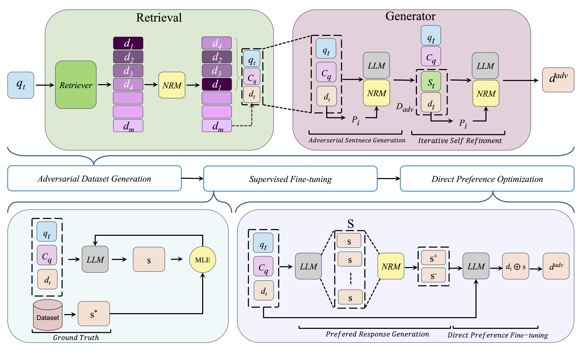

# Led to Mislead: Adversarial Content Injection for Attacks on Neural Ranking Models
[](https://huggingface.co/collections/radinrad/craft-68b50627b2b18994d0c4d701)


Our proposed framework, CRAFT, is a supervised, black-box adversarial attack framework for neural ranking models (NRMs). It generates fluent, context-aware attack vectors that, when injected into a payload document, reliably boost rank while preserving content fidelity and grammaticality.

## Framework Architecture



The CRAFT framework operates through three integrated components:

```
┌─────────────────────────────────────────────────────────────────┐
│                        CRAFT Framework                          │
├─────────────────────────────────────────────────────────────────┤
│ Dataset Generation: Adversarial Example Creation              │
│ ├─ LLM-based sentence generation                               │
│ ├─ Neural ranking model validation                             │
│ └─ Iterative refinement loop                                  │
├─────────────────────────────────────────────────────────────────┤
│ Training: Supervised Fine-Tuning                               │
│ ├─ MLE training on curated adversarial examples               │
│ ├─ CRAFT-Llama3.3 and CRAFT-Qwen3 variants                   │
│ └─ Transformation function learning                           │
├─────────────────────────────────────────────────────────────────┤
│ Optimization: Direct Preference Optimization                   │
│ ├─ Preference pair construction                               │
│ ├─ Ranking feedback as reward signals                        │
│ └─ Policy alignment with attack objectives                   │
└─────────────────────────────────────────────────────────────────┘
```

## Installation

### Setup

1. **Clone the repository**:
```bash
git clone https://github.com/aminbigdeli/CRAFT.git
cd CRAFT
```

2. **Install dependencies**:
```bash
pip install -r requirements.txt
```

3. **Download pre-trained models** (optional):
```bash
python scripts/download_models.py --all
```

## Quick Start

### Dataset Generation

Generate adversarial examples using the iterative refinement approach:

```bash
# Basic dataset generation (no feedback loop)
python src/craft/dataset_generation/main_no_think.py

# Advanced dataset generation (with feedback loop)
python src/craft/dataset_generation/main_think.py
```

**Note**: Ensure your data files are properly formatted and placed in the `data/raw/` directory before running.

### Training

Train the CRAFT models using supervised fine-tuning:

```bash
# Train with R1 model (DeepSeek-R1-Distill-Llama-70B)
python src/craft/training/train_sft.py --model r1

# Train with Qwen model (QwQ-32B)
python src/craft/training/train_sft.py --model qwen

# Train with custom dataset
python src/craft/training/train_sft.py --model r1 --dataset path/to/custom_dataset.json

# Validate dataset only (no training)
python src/craft/training/train_sft.py --model r1 --validate-only

# Advanced training with custom parameters
python src/craft/training/train_sft.py \
    --model qwen \
    --dataset data/sft_data/custom_qwen_sft.json \
    --validate-only
```

**Configuration**: Update the training parameters in the script files or configuration files as needed.

### Optimization

Apply Direct Preference Optimization to align models with attack objectives:

```bash
# DPO optimization with R1 model
python src/craft/optimization/train_dpo.py --model r1

# DPO optimization with Qwen model
python src/craft/optimization/train_dpo.py --model qwen

# DPO optimization with custom dataset
python src/craft/optimization/train_dpo.py --model r1 --dataset path/to/custom_dpo_dataset.jsonl

# Validate DPO dataset only (no training)
python src/craft/optimization/train_dpo.py --model r1 --validate-only

# Advanced DPO with custom parameters
python src/craft/optimization/train_dpo.py \
    --model qwen \
    --dataset data/dpo_data/custom_qwen_dpo.jsonl \
    --validate-only
```

### Inference

Run inference to generate adversarial content:

```bash
# Execute inference script
python src/craft/inference.py

# Inference with custom parameters
python src/craft/inference.py \
    --host localhost \
    --port 8000 \
    --model QwQ32B \
    --model-name QwQ32B-DPO-V1 \
    --num-responses 16 \
    --batch-size 16 \
    --max-workers 12 \
    --scoring-gpus 0,1,2,3 \
    --scoring-workers 4 \
    --timeout 15 \
    --max-attempts 1 \
    --temperature 0.6 \
    --max-tokens 128 \
    --cross-encoder ./surrogates/S3
```


### Configuration Files

- Update `configs/training_config.yaml` with your specific settings

## Repository Structure

```
CRAFT/
├── src/                          # Source code
│   ├── craft/                    # Core CRAFT implementation
│   │   ├── dataset_generation/   # Adversarial dataset generation
│   │   │   ├── main_no_think.py
│   │   │   └── main_think.py
│   │   ├── training/             # Supervised fine-tuning
│   │   │   └── train_sft.py
│   │   ├── optimization/         # Direct preference optimization
│   │   │   └── train_dpo.py
│   │   └── inference.py          # Inference engine
│   ├── utils/                    # Utility functions
│   └── evaluation/               # Evaluation metrics
├── data/                         # Data directory
│   ├── raw/                      # Raw datasets
│   └── processed/                # Processed datasets
├── experiments/                  # Experiment scripts
│   ├── dataset_generation/       # Dataset generation experiments
│   ├── training/                 # Training experiments
│   └── optimization/             # Optimization experiments
├── configs/                      # Configuration files
├── prompts/                      # LLM prompts
├── scripts/                      # Utility scripts
├── docs/                         # Documentation
├── notebooks/                    # Jupyter notebooks
├── README.md                     # This file
├── requirements.txt              # Dependencies
└── workflow.png                  # Framework diagram
```

Our fine-tuned models are available on [HuggingFace](https://huggingface.co/collections/radinrad/craft-68b50627b2b18994d0c4d701):

- **CRAFT-Llama3.3**: Based on DeepSeek-R1-Distill-Llama-70B
- **CRAFT-Qwen3**: Based on QwQ-32B

```bash
# Download models
python scripts/download_models.py --model craft_qwen3 --output_dir models/
python scripts/download_models.py --model craft_llama3.3 --output_dir models/
```

---
